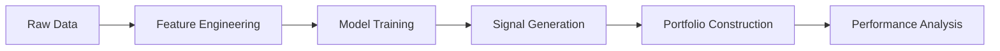

# 📈 Investment Portfolio Construction: ML-Driven Strategy to Outperform IMOEX 

[](https://www.python.org/)
[](https://python-poetry.org/)
[](https://dvc.org/)

A diploma project building a machine learning-powered investment strategy to **consistently outperform** the Moscow Exchange Index (IMOEX). Combines equity selection with risk-managed portfolio construction using RUONIA rates.

---

## 🎯 Project Overview

#### Objective
Develop an **automated trading pipeline** using ML/DL models to generate buy/sell signals, constructing diversified portfolios that:
1. Outperform IMOEX returns
2. Mitigate risk through sector diversification and RUONIA rate hedging

#### Key Innovations
- **Hybrid strategy**: Combines equities with RUONIA deposits for downside protection
- **Multi-source data**: Integrates endogenous (price data) and exogenous (commodities, FX, bonds) features
- **Advanced feature engineering**: Technical indicators + macroeconomic derivatives

---

## 📊 Visualizations

#### Strategy performance


#### Strategy performance detailed


---


## 🏆 Key Results

#### Metrics on validation dataset

|                                                            	| Strategy 	|  MCFTRR 	|
|------------------------------------------------------------	|:--------:	|:-------:	|
|                         Sharp ratio                        	|   0.049  	|  0.018  	|
|                        Max drawdown                        	|  -19.29% 	| -53.71% 	|
|                            Beta                            	|   0.33   	|    1    	|
|                     Value at Risk (VaR)                    	|   1.93%  	|   3.5%  	|
| Outperformance of portfolio return index over MCFTRR index 	|   48.59  	|  -48.59 	|

#### Interpretation

- The maximum portfolio drawdown (-20%) was significantly lower than the benchmark (-53%)
- The VaR index confirms effective risk control
- The average annualized return consistently outperforms the MCFTRR index

---

## 🧠 Methodology

#### Data Pipeline


---

## ⚙️ Installation & Usage

#### Requirements
- `python >=3.10<3.12`
- `poetry >= 2.1.3` (dependency management)
- `dvc` (data version control)

#### Data Management (DVC)

```bash
# Configure DVC
poetry run dvc remote modify s3-portfolio-construction --local access_key_id $DVC_ACCESS_KEY_ID
poetry run dvc remote modify s3-portfolio-construction --local secret_access_key $DVC_SECRET_ACCESS_KEY

# Pull/Push data
poetry run dvc pull
poetry run dvc push
```

#### Installation

```bash
poetry install
```


#### Running service locally

```bash
cd webservice
poetry run uvicorn main:app --reload
```

---

## 📂 Project Structure

```bash
/portfolio_constructor # python module files for strategy calculation
/webservice # python + HTML + CSS + JS files for webservice
```

## 🤝 Contribution Guidelines

#### Setup pre-commit hooks:

```bash
poetry run pre-commit install
```

#### Format code:

```bash
poetry run ruff format .
```

#### Add new dependencies:

```bash
poetry add <package> --group dev  # For development tools
poetry add <package> --group main # For core dependencies
```